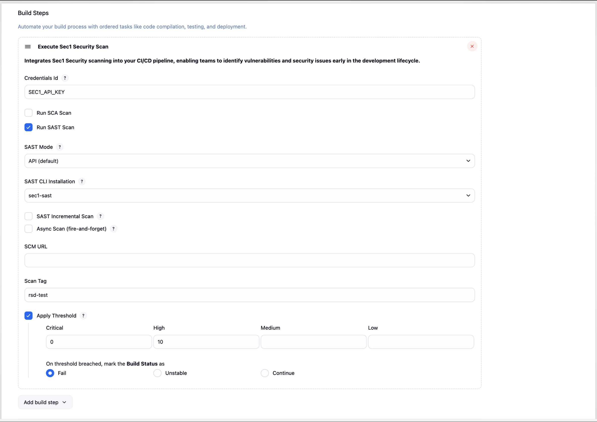

# Sec1 Security Scanner

[](https://sec1.io)

## Introduction

Integrates Sec1 Security scanning into your CI/CD pipeline, enabling teams to identify vulnerabilities and security issues early in the development lifecycle.

## Usage
To use the plugin up you will need to take the following steps in order:

1. [Install the Sec1 Security Plugin](#1-install-the-sec1-security-plugin)
2. [Configure a Sec1 API Token Credential](#2-configure-a-sec1-api-token-credential)
3. [Add Sec1 Security to your Project](#3-add-sec1-security-to-your-project)

## 1. Install the SEC1 Security Scanner Plugin

- Go to "Manage Jenkins" > "System Configuration" > "Plugins".
- Search for "Sec1 Security Scanner" under "Available plugins".
- Install the plugin.

### Custom Endpoints

By default, Sec1 uses the following endpoints:
- **API endpoint**: `https://api.sec1.io`
- **Dashboard endpoint**: `https://unified.sec1.io`

It is possible to configure custom endpoints by setting environment variables:

- Go to "Manage Jenkins" > "System Configuration" -> "System"
- Under "Global properties" check the "Environment variables" option
- Click "Add"
- Set `SEC1_INSTANCE_URL` to override the API endpoint
- Set `SEC1_DASHBOARD_URL` to override the dashboard endpoint (used for report URLs in build output)


## 2. Configure a Sec1 API Token Credential

- Go to "Manage Jenkins" > "Security" > "Credentials"
- Choose a Store
- Choose a Domain
- Go to "Add Credentials"
- Select "Secret text"
- Add `<YOUR_SEC1_API_KEY_ID>` as ID and Configure the Credentials.
- Remember the "ID" as you'll need it when configuring the build step.

To get `Sec1 Api Key` navigate to [My Account](https://account.sec1.io/) > "Login with GitHub" > Click on profile icon at top right > "Settings"  
- In "API key" section, click on "Generate API key"
- Copy key for use.

<blockquote>
<details>
<summary>📷 Show Preview</summary>


</details>
</blockquote>

## 3. Add Sec1 Security to your Project

This step will depend on if you're using Freestyle Projects or Pipeline Projects.

### Freestyle Projects

- Select a project
- Go to "Configure"
- Under "Build", select "Add build step" select "Execute Sec1 Security Scanner"
- Configure as needed. Click the "?" icons for more information about each option.

<blockquote>
<details>
<summary>📷 Show Preview</summary>



</details>
</blockquote>

### Pipeline Projects

Use the `sec1Security` step as part of your pipeline script. You can use the "Snippet Generator" to generate the code
from a web form and copy it into your pipeline.

<blockquote>
<details>
<summary>📷 Show Example</summary>

```groovy
pipeline {
  agent any

  stages {
    stage('Build') {
      steps {
        echo 'Building...'
      }
    }
    stage('Sec1 Security Scan') {
      steps {
        script {
          sec1Security(
            apiCredentialsId: '<Your Sec1 Api Key ID>',
            runSca: true,
            runSast: true,
            scanTag: 'my-scan-tag',
            applyThreshold: true,
            actionOnThresholdBreached: 'unstable',
            threshold: [criticalThreshold: '0', highThreshold: '0', mediumThreshold: '0', lowThreshold: '0']
          )
        }
      }
    }
    stage('Deploy') {
      steps {
        echo 'Deploying...'
      }
    }
  }
}
```

</details>
</blockquote>
You can pass the following parameters to your `sec1Security` step.

#### `apiCredentialsId` (required, default: *none*)

Sec1 API Key Credential ID. As configured in "[2. Configure a Sec1 API Token Credential](#2-configure-a-sec1-api-token-credential)".

#### `runSca` (optional, default: `true`)

Whether SCA (Software Composition Analysis) scan needs to be executed for the configured git repository.

#### `runSast` (optional, default: `true`)

Whether SAST (Static Application Security Testing) scan needs to be executed for the configured git repository.

#### `scanTag` (optional, default: *branch name*)

A tag to identify this scan. If not provided, the branch name is used. If the branch name is also unavailable, defaults to `default`.

#### `applyThreshold` (optional, default: `false`)

Whether vulnerability threshold needs to be applied on the build.

#### `threshold` (optional, default: *none*)

Threshold values for each type of vulnerability. Example configuration:
`[criticalThreshold: '0', highThreshold: '10', mediumThreshold: '0', lowThreshold: '0']`

If the scan reports more vulnerabilities than the configured threshold for the respective severity, an error will be shown in the console and the build status will be modified based on `actionOnThresholdBreached`.

#### `actionOnThresholdBreached` (optional, default: `fail`)

The action to take on the build if a vulnerability threshold is breached. Possible values: `fail`, `unstable`, `continue`

## Troubleshooting

To see more information on your steps:

- View the "Console Output" for a specific build.

---

-- Sec1 team
