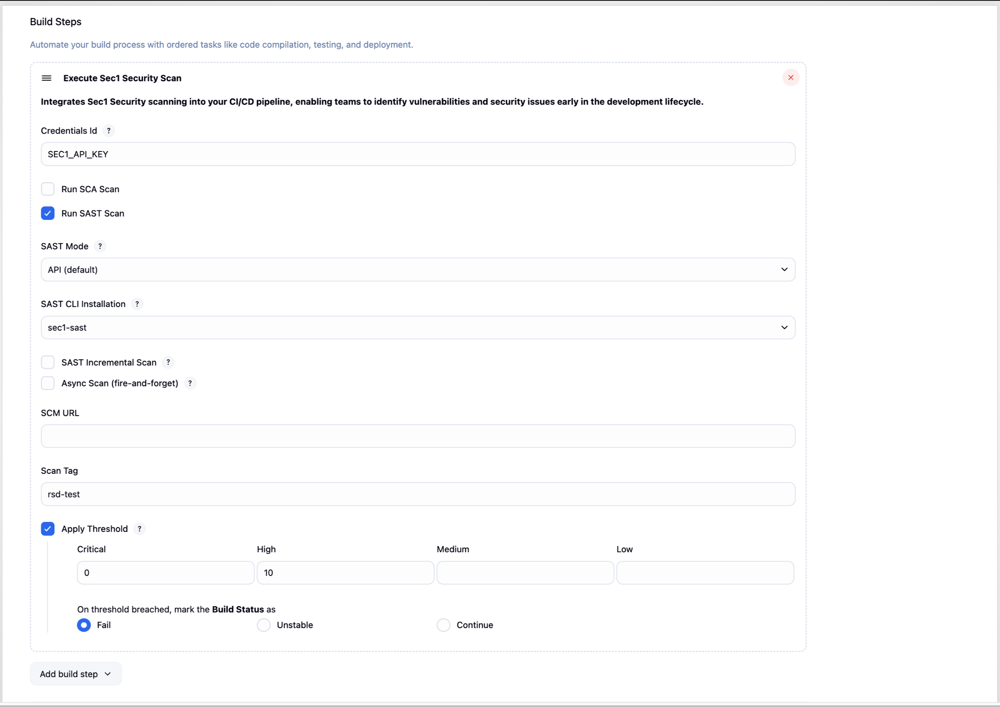

# Sec1 Security Scanner

[](https://sec1.io)

## Introduction

Integrates Sec1 Security scanning into your CI/CD pipeline, enabling teams to identify vulnerabilities and security issues early in the development lifecycle.

## Usage
To use the plugin up you will need to take the following steps in order:

1. [Install the Sec1 Security Plugin](#1-install-the-sec1-security-plugin)
2. [Configure a Sec1 API Token Credential](#2-configure-a-sec1-api-token-credential)
3. [Add Sec1 Security to your Project](#3-add-sec1-security-to-your-project)

## 1. Install the SEC1 Security Scanner Plugin

- Go to "Manage Jenkins" > "System Configuration" > "Plugins".
- Search for "Sec1 Security Scanner" under "Available plugins".
- Install the plugin.

### Custom Endpoints

By default, Sec1 uses the following endpoints:
- **API endpoint**: `https://api.sec1.io`
- **Dashboard endpoint**: `https://unified.sec1.io`

It is possible to configure custom endpoints by setting environment variables:

- Go to "Manage Jenkins" > "System Configuration" -> "System"
- Under "Global properties" check the "Environment variables" option
- Click "Add"
- Set `SEC1_INSTANCE_URL` to override the API endpoint
- Set `SEC1_DASHBOARD_URL` to override the dashboard endpoint (used for report URLs in build output)


## 2. Configure a Sec1 API Token Credential

- Go to "Manage Jenkins" > "Security" > "Credentials"
- Choose a Store
- Choose a Domain
- Go to "Add Credentials"
- Select "Secret text"
- Add `<YOUR_SEC1_API_KEY_ID>` as ID and Configure the Credentials.
- Remember the "ID" as you'll need it when configuring the build step.

To get `Sec1 Api Key` navigate to [My Account](https://account.sec1.io/) > "Login with GitHub" > Click on profile icon at top right > "Settings"  
- In "API key" section, click on "Generate API key"
- Copy key for use.

<blockquote>
<details>
<summary>📷 Show Preview</summary>


</details>
</blockquote>

## 3. Add Sec1 Security to your Project

This step will depend on if you're using Freestyle Projects or Pipeline Projects.

### Freestyle Projects

- Select a project
- Go to "Configure"
- Under "Build", select "Add build step" select "Execute Sec1 Security Scanner"
- Configure as needed. Click the "?" icons for more information about each option.

<blockquote>
<details>
<summary>📷 Show Preview</summary>



</details>
</blockquote>

### Pipeline Projects

Use the `sec1Security` step as part of your pipeline script. You can use the "Snippet Generator" to generate the code
from a web form and copy it into your pipeline.

<blockquote>
<details>
<summary>📷 Show Example</summary>

```groovy
pipeline {
  agent any

  stages {
    stage('Build') {
      steps {
        echo 'Building...'
      }
    }
    stage('Sec1 Security Scan') {
      steps {
        script {
          sec1Security(
            apiCredentialsId: '<Your Sec1 Api Key ID>',
            scmUrl: 'https://github.com/your-org/your-repo',
            runSca: true,
            runSast: true,
            sastIncrementalScan: false,
            asyncScan: false,
            scanTag: 'my-scan-tag',
            applyThreshold: true,
            actionOnThresholdBreached: 'unstable',
            threshold: [criticalThreshold: '0', highThreshold: '0', mediumThreshold: '0', lowThreshold: '0']
          )
        }
      }
    }
    stage('Deploy') {
      steps {
        echo 'Deploying...'
      }
    }
  }
}
```

</details>
</blockquote>
You can pass the following parameters to your `sec1Security` step.

#### `apiCredentialsId` (required, default: *none*)

Sec1 API Key Credential ID. As configured in "[2. Configure a Sec1 API Token Credential](#2-configure-a-sec1-api-token-credential)".

#### `scmUrl` (optional, default: *auto-detected*)

Git repository URL to scan. If not provided, the plugin attempts to detect it from the workspace `.git/config` or the `GIT_URL` environment variable. Use this parameter when auto-detection fails (e.g., on some pipeline configurations).

#### `runSca` (optional, default: `true`)

Whether SCA (Software Composition Analysis) scan needs to be executed for the configured git repository.

#### `runSast` (optional, default: `true`)

Whether SAST (Static Application Security Testing) scan needs to be executed for the configured git repository.

#### `scanMode` (optional, default: `api`)

Where scans run — one setting for both SCA and SAST:

- `api` (default) — the Sec1 server clones the repository and runs both scans on its side.
- `cli` — both scans run on the Jenkins agent, so neither your code nor your registry credentials leave the network. Requires `cliInstallation`. See [Running scans on the agent (CLI mode)](#running-scans-on-the-agent-cli-mode).

#### `cliInstallation` (required for `scanMode: 'cli'`)

Name of a **Sec1 CLI** tool installation (Manage Jenkins → Tools → Sec1 CLI). One installation serves both scans.

#### `sbomFile` (optional, CLI mode only)

Workspace-relative path to an SBOM file (JSON) your build already generates. When set, SCA uploads that file instead of generating one. Useful on air-gapped agents or when you keep an SBOM as a compliance artifact.

#### `sastIncrementalScan` (optional, default: `false`)

Run the SAST scan in incremental mode. Only changed code is analyzed, which is faster for large repositories. Requires a baseline full scan to exist on the Sec1 server.

#### `asyncScan` (optional, default: `false`)

Fire-and-forget mode. The plugin submits the scan and exits without waiting for the result, so the pipeline keeps running while the scan completes on the Sec1 server. The report URL is printed in the build log.

If `applyThreshold` is also `true`, the plugin still polls for the result since threshold checks need the final counts. Use `asyncScan` without `applyThreshold` to get true fire-and-forget behavior.

#### `scanTag` (optional, default: *branch name*)

A tag to identify this scan. If not provided, the branch name is used. If the branch name is also unavailable, defaults to `default`.

#### `applyThreshold` (optional, default: `false`)

Whether vulnerability threshold needs to be applied on the build.

#### `threshold` (optional, default: *none*)

Threshold values for each type of vulnerability. Example configuration:
`[criticalThreshold: '0', highThreshold: '10', mediumThreshold: '0', lowThreshold: '0']`

A severity breaches its threshold when its count is non-zero and greater than or equal to the configured value — so `criticalThreshold: '0'` means "fail on the first critical finding", and a clean scan never breaches. On a breach, an error is shown in the console and the build status is set based on `actionOnThresholdBreached`.

#### `actionOnThresholdBreached` (optional, default: `fail`)

The action to take on the build if a vulnerability threshold is breached. Possible values: `fail`, `unstable`, `continue`

## Scan duration

The plugin polls every 10 seconds for the scan result and times out after 30 minutes. For scans that take longer, set `asyncScan: true` (without `applyThreshold`) so the pipeline does not block.

## Running scans on the agent (CLI mode)

By default both scans run on the Sec1 server, which clones your repository. With `scanMode: 'cli'` they run on the Jenkins agent instead — use this when the Sec1 server cannot reach your repository (private SCM, air-gapped network) or your dependencies live in a private registry (Nexus, Artifactory, private npm).

- **SAST** analyzes the checked-out workspace with the `sec1-sast` engine and uploads only the findings report.
- **SCA** resolves your dependencies on the agent, generates an SBOM with the Sec1 CLI and uploads it. Dependencies are resolved with the agent's own toolchain and credentials (`settings.xml`, `.npmrc`, …), so private registries work without giving the Sec1 server access to them.

### One-time setup

1. Go to **Manage Jenkins → Tools → Sec1 CLI installations → Add Sec1 CLI**, name it (for example `sec1-cli`), tick **Install automatically** and choose **Install from sec1.io (latest)**. Each agent downloads the right binaries for its platform on first use and refreshes them daily.
2. Make sure the agent has the project's build tools on its `PATH` — SBOM generation runs them to resolve the full dependency tree: `node`/`npx` for every project, plus `mvn` for Maven projects and `gradle` (or a `./gradlew` wrapper) for Gradle projects. If a tool is installed but not on the agent's `PATH`, add it under **Manage Jenkins → System → Global properties → Environment variables**, for example `PATH+MAVEN` = `/opt/apache-maven-3.9.6/bin`.

   Without the build tool, generation falls back to reading the manifest directly, which captures only direct dependencies — vulnerabilities in transitive dependencies are missed. The scan log warns about this explicitly (see below).

### Pipeline example

Check out the repository before the scan and run the step inside it — CLI mode scans the files in the workspace:

```groovy
pipeline {
  agent any
  stages {
    stage('Sec1 Security Scan') {
      steps {
        checkout scm
        sec1Security(
          apiCredentialsId: '<Your Sec1 Api Key ID>',
          scanMode: 'cli',
          cliInstallation: 'sec1-cli',
          runSca: true,
          runSast: true,
          applyThreshold: true,
          actionOnThresholdBreached: 'unstable',
          threshold: [criticalThreshold: '0', highThreshold: '0']
        )
      }
    }
  }
}
```

`scmUrl` and `scanTag` are optional here: the plugin detects the repository URL and branch from the checkout. If you set them from environment variables, guard against unset values — in Groovy `"${env.REPO_URL}"` becomes the literal string `null` when the variable is missing. Use `scmUrl: env.REPO_URL ?: ''` instead.

### What you will see

- Every CLI-mode scan prints the engine/CLI version it ran (`Engine Version …`, `CLI Version …`), so you can tell which build produced the findings.
- **Multi-module repositories:** one SBOM is generated and uploaded per package-manager location (each Maven module, each `package.json` directory, …), so the Sec1 dashboard shows findings per module. Thresholds apply to the combined totals.
- **C/C++ repositories:** libraries vendored into the source tree (mbedTLS, zlib, FreeRTOS, lwIP, …) are identified from their version headers, compiled binaries and directory layout — the same fingerprinting the Sec1 server uses.
- **Incomplete SBOM warning:** if the agent cannot resolve dependencies (build tool missing, private registry unreachable), the log shows `SBOM may be INCOMPLETE …`. Treat findings from that run as a lower bound and fix the agent setup.
- Output from the SBOM generator and build tools is kept out of the console and written to `sec1-sbom-generation.log` in the workspace; the last lines are shown automatically if generation fails.
- `asyncScan` and `sastIncrementalScan` are ignored in CLI mode; scans run synchronously on the agent.

### Older parameters

Configurations written for earlier releases keep working: `sastMode: 'cli'` with `sastInstallation`, and `scaMode: 'sbom'` with `scaInstallation`. They set each scan separately and need separate tool installations; prefer `scanMode` with a single `cliInstallation` for new jobs.

## Troubleshooting

To see more information on your steps:

- View the "Console Output" for a specific build.

---

-- Sec1 team
